## Part 1. Настройка **gitlab-runner**

##### Поднимем виртуальную машину *Ubuntu Server 22.04 LTS*.

- Скачаем и установим на виртуальную машину **gitlab-runner**:
   ```
   curl https://packages.gitlab.com/install/repositories/gitlab/gitlab-ee/script.deb.sh | sudo bash
   sudo apt-get install gitlab-runner
   ```

- Запустим **gitlab-runner** и зарегистрируй его для использования в текущем проекте (*DO6_CICD*):
   ```
   sudo gitlab-runner start
   ```
- Для регистрации понадобятся URL и токен, которые можно получить на страничке задания на платформе:

   ```
   sudo gitlab-runner register
   ```
   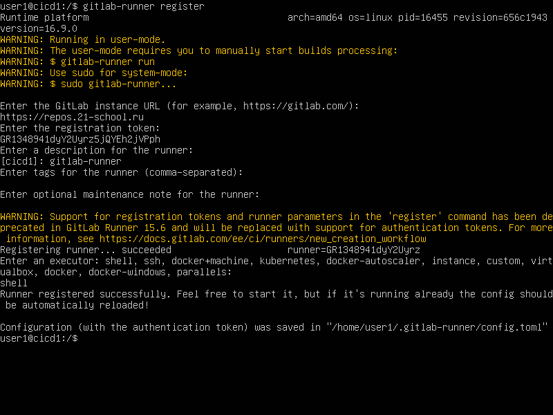
   
## Part 2. Сборка

##### Напишем этап для **CI** по сборке приложений из проекта *C2_SimpleBashUtils*.

- На виртуальной машине устанавливаем необходимые для сборки библиотеки
   ```
   sudo apt-get install make
   sudo apt-get install gcc 
   ```

- клонируем проект CICD
- переходим на ветку Develop
- скачаваем проект C2_SimpleBashUtils
- копируем содержимое папки C2_SimpleBashUtils/src в src проекта CICD и пушим
- создаем файл .gitlab-ci.yml в проекте, заполняем его следующими инструкциями:
    ```
    stages:
    - build

    build:
    stage: build
    script: 
        - echo "Compiling the code..."
        - cd src/cat
        - make s21_cat
        - cd ../grep
        - make s21_grep
        - echo "Compile complete."
    artifacts:
        paths: 
        - src/cat/s21_cat
        - src/grep/s21_grep
        untracked: false
        when: on_success
        expire_in: 30 day
    ```
- пушим проект.
- в веб интерфейсе видим успешную сборку
- 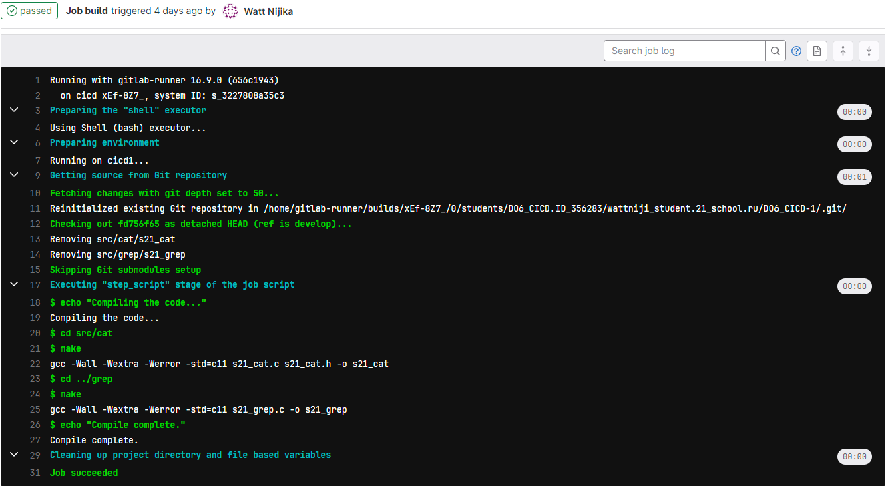

## Part 3. Тест кодстайла

- Напишем этап для **CI**, который запускает скрипт кодстайла (*clang-format*):

 - на виртуальную машину становить clang-format

- Если кодстайл не прошел, то «зафейлим» пайплайн и отобразим вывод утилиты *clang-format*.
    ```
    clang-test-job:   # This job runs in the test stage.
    stage: style_test    # It only starts when the job in the build stage completes successfully.
    script:
        - echo "Running clang tests..."
        - clang-format --style=Google -n src/cat/*.c > src/clang.txt 2>&1
        - clang-format --style=Google -n src/cat/*.h >> src/clang.txt 2>&1
        - clang-format --style=Google -n src/grep/*.c >> src/clang.txt 2>&1
        - clang-format --style=Google -n src/grep/*.h >> src/clang.txt 2>&1
        - cat src/clang.txt
        - ./src/style_test.sh
    when: on_success
    ```

- вывод при успешеном прохождении clang-format:
- 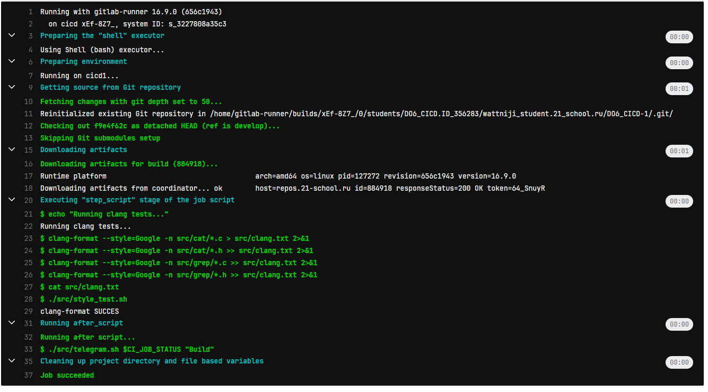

- вывод при неуспешеном прохождении clang-format:
- 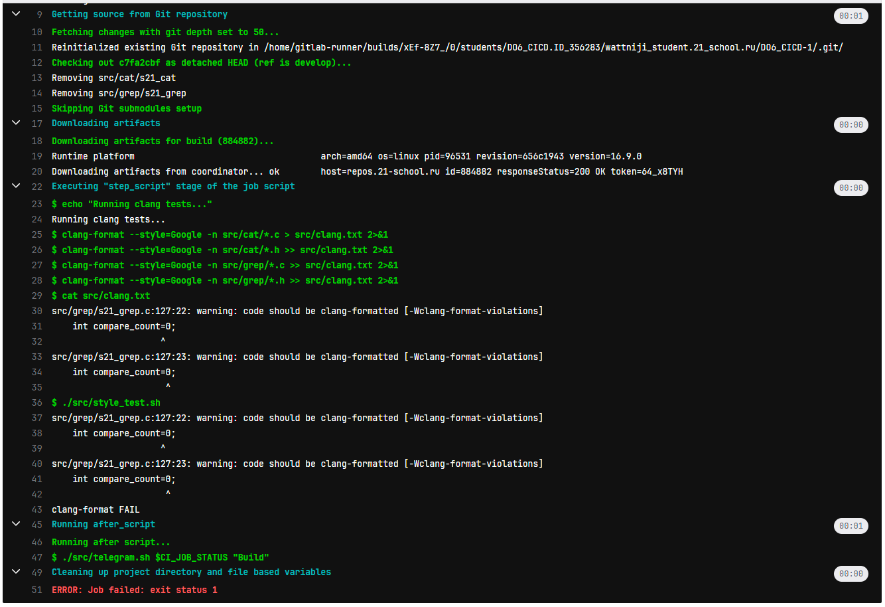

## Part 4. Интеграционные тесты

##### Напишем этап для **CI**, который запускает интеграционные тесты из того же проекта.

- Запустим этот этап автоматически только при условии, если сборка и тест кодстайла прошли успешно:
    ```
    unit-test-job:   # This job runs in the test stage.
    stage: code_test    # It only starts when the job in the build stage completes successfully.
    script:
        - echo "Running unit tests... This will take about 60 seconds."
        - cd src
        - cd cat
        - ./test_func_cat.sh &> test.txt
        - cd ../grep
        - ./test_func_grep.sh  &> test.txt
        - cd ..
        - ./code_test.sh
    when: on_success
    ```

- Если тесты не прошли, то «зафейлим» пайплайн, в пайплайне отобразим вывод, что интеграционные тесты успешно прошли / провалились:
   - вывод при успешеном прохождении clang-format:
   - 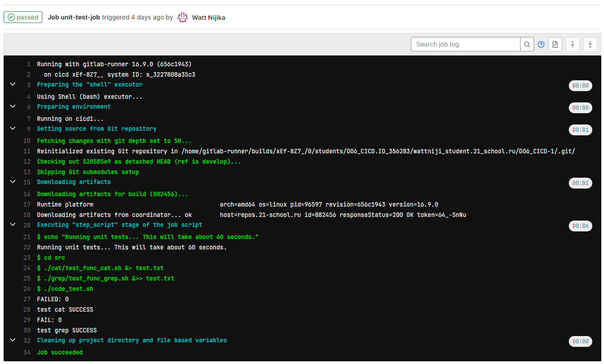

   - вывод при неуспешеном прохождении clang-format:
   - 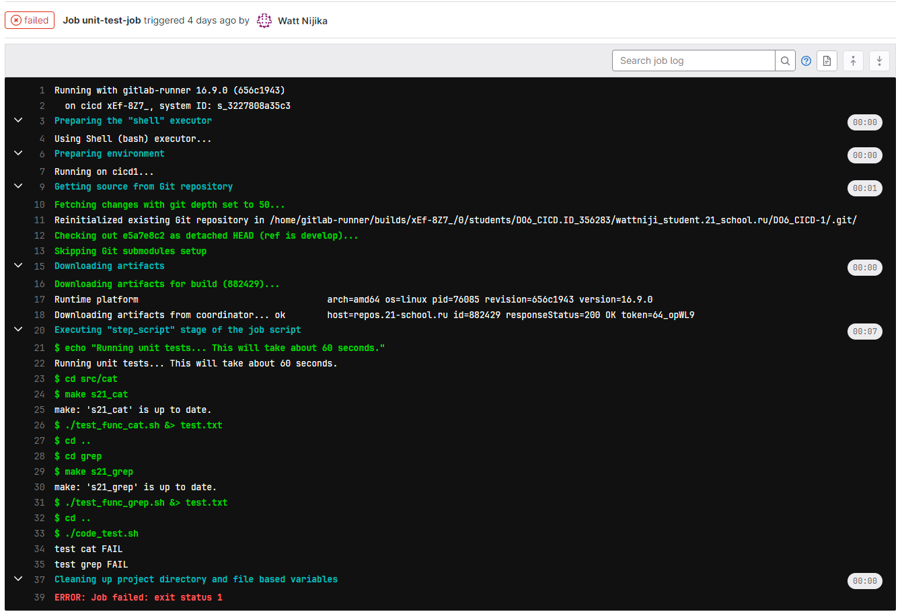
   
- При ошибке на предыдущих стадиях, стадия проверки тестами не запускается:
   - 


## Part 5. Этап деплоя

- Поднимем вторую виртуальную машину *Ubuntu Server 22.04 LTS*.
- установим на ней sudo apt-get install openssh-server
- статически соединим обе машины:
   - 1 машина (с gitlab-runner):
   - 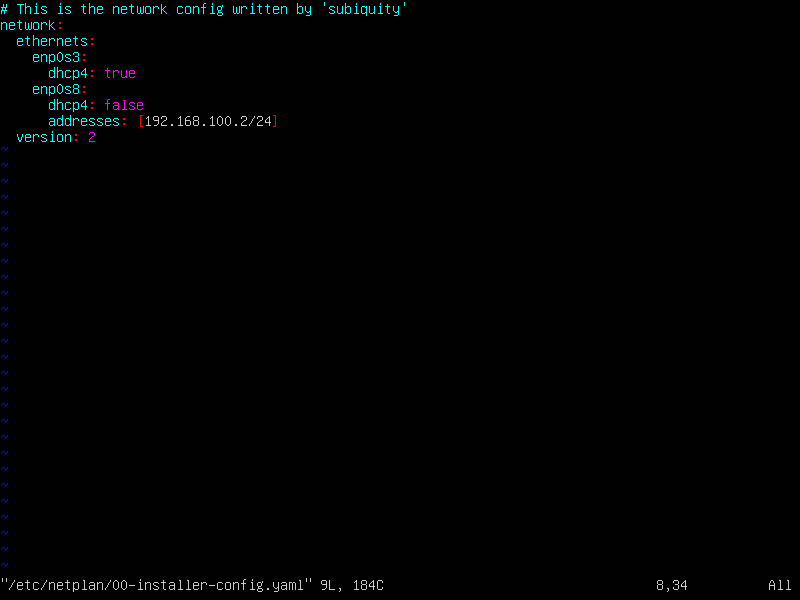
   - 2 машина (server):
   - 
   - на обеих машинах применим изменения sudo netplan apply
   
- создадим публичный ключ на первой машине от пользователя gitlab-runner
- копируем ключ на вторую машину:
   - 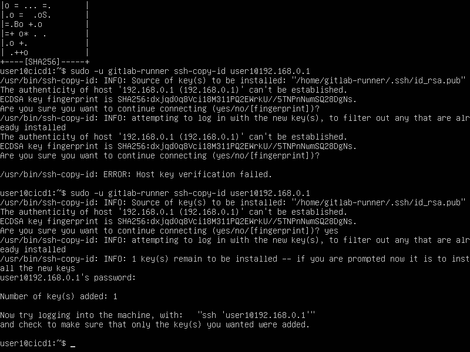
   
- проверим на второй машине, что ключ скопировался:
   - 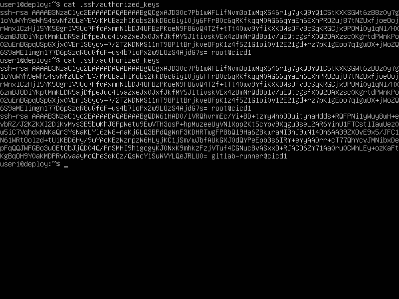
   
- запустим на второй машине service ssh start
- разрешим изменения в директории /usr/local/bin/
- напишем инструкцию для деплоя

    ```
    deploy-job:      # This job runs in the deploy stage.
    stage: deploy
    when: manual
    allow_failure: false
    script:
        - ./src/copy.sh
        - echo "Deploy is successfully copmlited"
    ```
- по результатам видим, что артефакты скопировались в папку /usr/local/bin/
   - 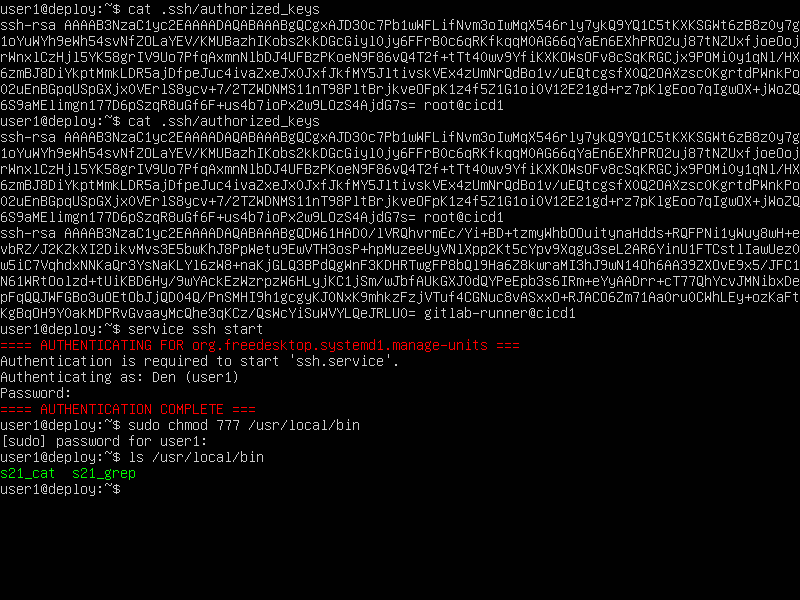 
   
## Part 6. Дополнительно. Уведомления

##### Настроим уведомления о успешном/неуспешном выполнении пайплайна через бота с именем «soniagil DO6 CI/CD» в *Telegram*:
- создадим бота soniagil DO6 CI/CD через @BotFather
- напишем скрипт для отправления уедомления и добавим в инстуркцию после каждого этапа:
    ```
    after_script:
        - ./src/telegram.sh
    ```
   - 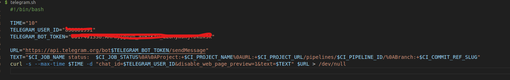 
   
- уведомления получены:

   - 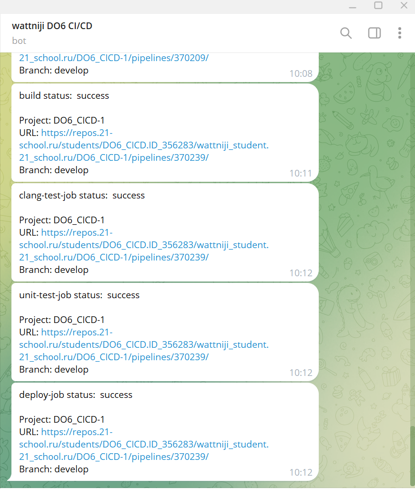

